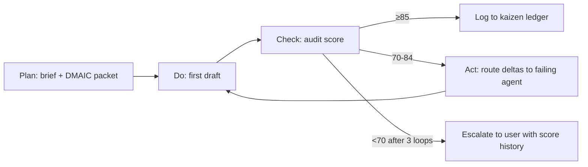

# Architecture — The 7-Agent Pipeline

The Viral Content Agent System is a **pipeline of specialists** coordinated by an Orchestrator. Each agent has a single, well-defined responsibility and a strict output schema so handoffs don't break.

## Pipeline Diagram

```
Brief
  │
  ▼
┌─────────────────────────────────────────────┐
│ 1. viral-orchestrator                       │
│    DMAIC: Define + Measure + Control        │
│    Outputs: refined brief JSON packet       │
│    Handoff to → viral-researcher            │
└─────────────────────────────────────────────┘
  │
  ▼
┌─────────────────────────────────────────────┐
│ 2. viral-researcher                          │
│    Gemba: top-performer analysis            │
│    Ch 2–3: Research Revolution + Subtle     │
│    Outputs: ranked performance drivers      │
│    Handoff to → viral-format-selector       │
└─────────────────────────────────────────────┘
  │
  ▼
┌─────────────────────────────────────────────┐
│ 3. viral-format-selector                    │
│    Part II: choose from 6 Viral Formats     │
│    Outputs: chosen format + format brief    │
│    Handoff to → viral-ideator               │
└─────────────────────────────────────────────┘
  │
  ▼
┌─────────────────────────────────────────────┐
│ 4. viral-ideator                            │
│    Ch 4: Creativity Blueprint               │
│    Outputs: ranked Ideation Sheet (10–30)   │
│    Handoff to → viral-storyteller           │
└─────────────────────────────────────────────┘
  │
  ▼
┌─────────────────────────────────────────────┐
│ 5. viral-storyteller                        │
│    Ch 5: Art of Storytelling                │
│    Outputs: hook + script + narrative arc   │
│    Handoff to → viral-comm-algo             │
└─────────────────────────────────────────────┘
  │
  ▼
┌─────────────────────────────────────────────┐
│ 6. viral-comm-algo                          │
│    Part III: 5 Rules + Big Three tones      │
│    Outputs: optimised script + 85% reach   │
│    Handoff to → viral-content-auditor       │
└─────────────────────────────────────────────┘
  │
  ▼
┌─────────────────────────────────────────────┐
│ 7. viral-content-auditor                     │
│    DMAIC Control + poka-yoke + score        │
│    Outputs: final score + control plan +    │
│             kaizen log entry                │
└─────────────────────────────────────────────┘
  │
  ▼
Audit score:
  ≥ 85  → close brief, log to kaizen ledger
  70–84 → one PDCA loop, route deltas back
  < 70  → escalate per Orchestrator's rule
```

---

## Agent Responsibilities (Single Responsibility Per Agent)

| # | Agent | Owns | Does NOT Own |
|---|---|---|---|
| 1 | `viral-orchestrator` | Brief intake, DMAIC standard work, routing, control plan | Creating content, scoring content |
| 2 | `viral-researcher` | Top-performer inventory, performance drivers, Pareto | Format selection, scripting |
| 3 | `viral-format-selector` | Choosing and detailing the Viral Format | Research, ideation |
| 4 | `viral-ideator` | Generating + ranking ideas via the Ideation Sheet | Hook writing, scripting |
| 5 | `viral-storyteller` | Hook (3-sec), narrative arc, Jenga Effect, generalist principle | Algorithm optimisation |
| 6 | `viral-comm-algo` | 5 Rules application, Big Three tone check, 85% reach validation | Format selection, ideation |
| 7 | `viral-content-auditor` | Final score (0–100), poka-yoke enforcement, kaizen log, control plan | Anything else (read-only on outputs) |

---

## Handoff Contract

Each handoff is a **strict JSON object**. No free-text. No schema drift. The Orchestrator's output schema is the canonical reference; downstream agents inherit the same structure for their own outputs.

### Canonical Handoff Envelope

```json
{
  "agent": "<agent-name>",
  "agent_version": "<semver>",
  "brief_id": "<uuid from orchestrator>",
  "iteration": <int, starts at 1>,
  "received_from": "<previous agent>",
  "output": { /* agent-specific */ },
  "poka_yoke_passed": [ "<check name>", ... ],
  "schema_valid": true,
  "issues": [],
  "next_agent": "<next agent>",
  "handoff_at": "<iso8601>"
}
```

The Orchestrator **rejects** any handoff that:
- Has `schema_valid: false`
- Has any entry in `issues`
- Is missing required `poka_yoke_passed` entries

---

## Iteration Loops (PDCA)



**Max iterations before escalation: 3.** Don't loop forever — escalate with the score history and 5-Whys.

---

## Per-Agent MUST-HAVES (Non-Negotiables)

Every agent must include in its system prompt:

1. **The relevant methodology chunk** baked in as rules (not flavour text)
2. **Strict input/output schema** (JSON or markdown) — handoff contracts are non-negotiable
3. **The 7-myths poka-yoke** injected at every stage
4. **An evaluation hook** — output must be scoreable against the model
5. **Banned-phrase / banned-tone list** for that agent's domain
6. **Standard work template** (LSS: every output follows the same proven format)
7. **A measurement criterion** (LSS: what's the metric that proves this output succeeded?)

---

## Current Status

| Agent | Status |
|---|---|
| `viral-orchestrator` | ✅ Built |
| `viral-researcher` | ⏳ Pending |
| `viral-format-selector` | ⏳ Pending |
| `viral-ideator` | ⏳ Pending |
| `viral-storyteller` | ⏳ Pending |
| `viral-comm-algo` | ⏳ Pending |
| `viral-content-auditor` | ⏳ Pending |
